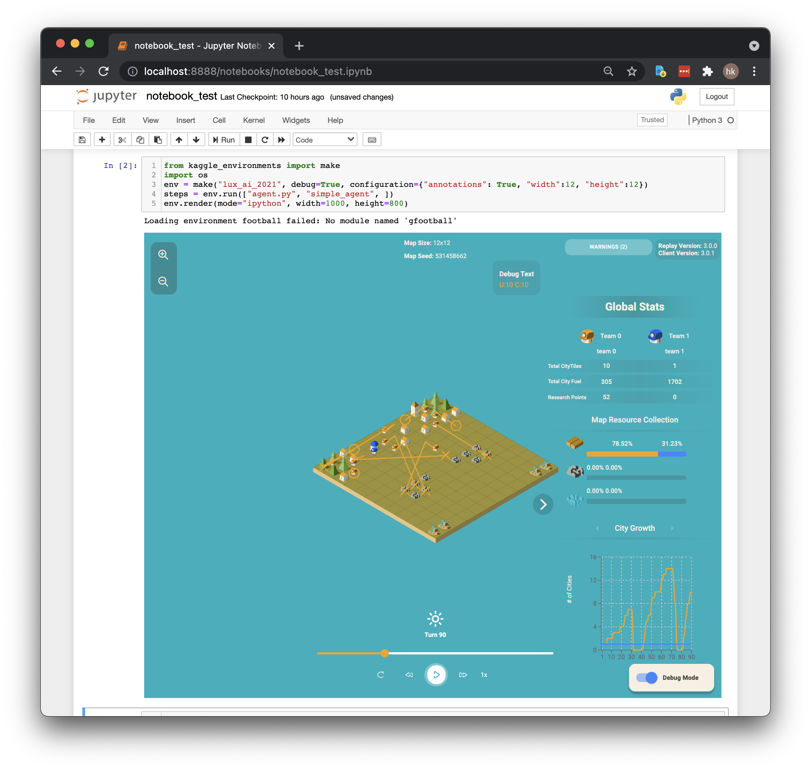
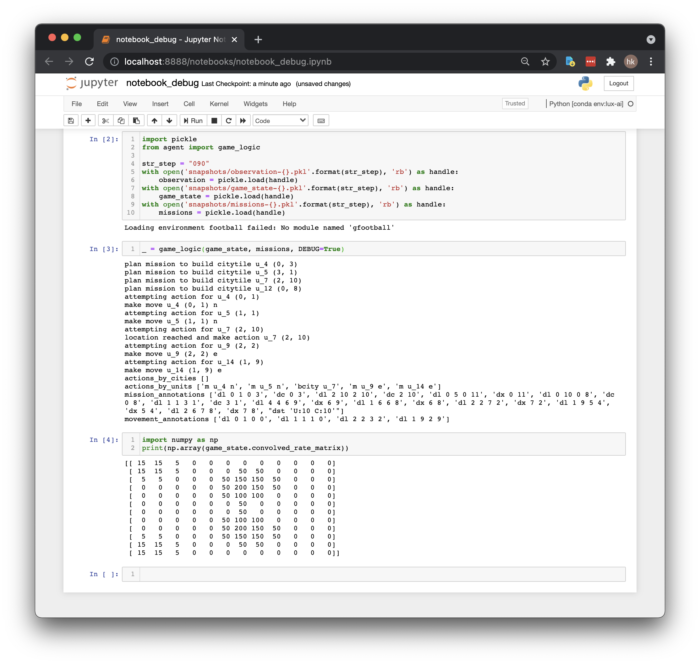

## Lux AI Working Title Bot

Please refer to the [Kaggle notebook](https://www.kaggle.com/huikang/lux-ai-working-title-bot) for questions about the code structure and agent logic.

This README will explain how to use this repository.

#### Setup

See `./setup.sh` for the scripts and comments to install the required components.

You will need Node version 12 or above.

#### Make submission files

Run `./make_submit.sh` to generate the following files

- The zipfile `submission.tar.gz` which can be submitted to Kaggle [directly](https://www.kaggle.com/c/lux-ai-2021/submissions).
- The notebook submission `notebook_generated.ipynb`. You can upload this notebook into a [fork of my notebook](https://www.kaggle.com/kernels/fork-version/73552476) and submit.

#### Running a Game

You can run a game with `notebook_test.ipynb`

You may define the width and height of the board, as well as the seed. Annotations are shown on the board.

This code snippet is also run in the [generated notebook](https://www.kaggle.com/huikang/lux-ai-working-title-bot#Game-Rendering).

If you want to compare between the bots, it is recommended that you use the contest command line interface `lux-ai-2021`.
`make_tournament.sh` contains some scripts that I use to test my bots against its earlier versions.

#### Analysing Game State and Missions

You may run the game logic on a specific turn with `notebook_debug.ipynb` to understand why the agent has made a certain decision.

When the run is made with `notebook_test.ipynb`, the game state, and missions are saved as Python pickle files. You may load the Python pickle file and run the game logic to produce the actions and updated missions.

As the game logic is run, it prints the new mission planned, the actions made include the annotation.

You can modify the code and see how the agent reacts different for the same game state and missions. This allows you iteratively improve the agent more quicking.

This code [snippet](https://www.kaggle.com/huikang/lux-ai-working-title-bot?scriptVersionId=73552476#Debugging) is also run in the generated notebook.
